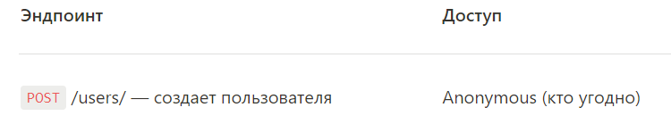

# Skypro_PD_13.0_Sergey_Levchuk_HW_19

---

## ИТОГИ
* Практически все шаги выполнены

***

### **Не понял как сделать и не смог проверить**

--- Шаг 6. Ограничьте доступ на редактирование
* Защитите (ограничьте доступ) так, чтобы к некоторым 
эндпоинтам был доступ только у администраторов 
( user.role == admin ) Для этого создайте декоратор 
admin_required и декорируйте им методы, которые нужно защитить.

Как проверить работу декоратора??? Сам декоратор создан
```python
@auth_required 
@admin_required # как проверить этот функционал? Правильный он? 
def put(self, mid):
    req_json = request.json
    req_json["id"] = mid
    movie_service.update(req_json)
    return "", 204
```

--- Шаг 7. Добавьте регистрацию пользователя

Создал саму регистрацию, Но не совсем понял колонку 
* **ДОСТУП**: Anonymous (кто угодно)

Это нужно еще что-то сделать? Или дополнить проверку?

---

**В итоге урок 19,2 для меня полностью не ясен, от слова совсем**
Примеры которые я находил в сети ПОЛНОСТЬЮ не соответствовали примерам из урока,
что и привело в "тупиковое" состояние. Надеюсь, кто будет это проверять
даст мало мальское пояснение.